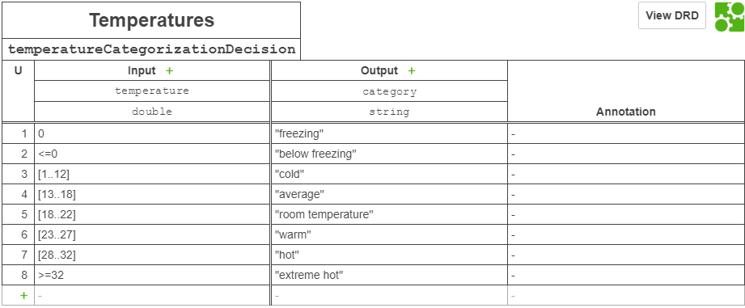
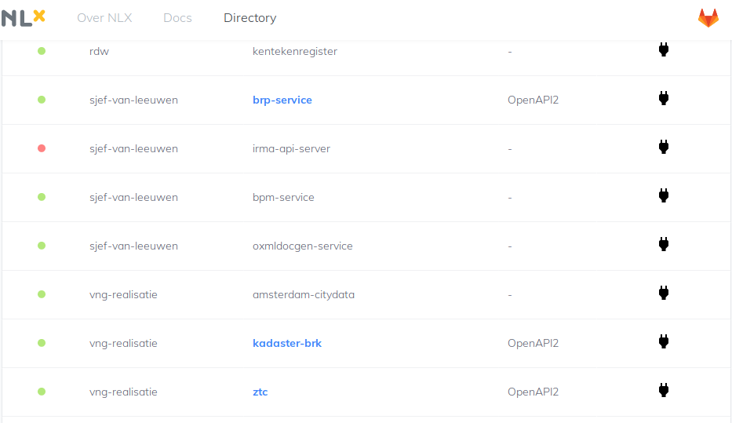

# BPMN / DMN as a NLX Common Ground Service


## Status

This project is highly experimental. It researches the possibility in combining NLX transport network in BPM and Rules (DMN decision modeling language).

## Conceptual Idea

Camunda provides a DMN modeler for modeling decisions. These decisions can then be stored and forked and versioned on Github. These rules are easily versioned as they are defined as XML. With forking organizations can reuse rules and make slight alterations to them.

The dmn model is executed using a RESTfull API that is provided on the inter organizational network NLX.

Organizaitons on the NLX transport ring can then executre rules that they together maintain.

## DMN As An NLX Service Example

In the example below, we use a DMN decision table located on Github master branch and executes it via NLX.

### Temperature Decision Table

The following decision table is modeled



### Input

```json
{
  "uri" : "https://raw.githubusercontent.com/sjefvanleeuwen/Camunda.Api.Client/master/Camunda.Nlx.Service/doc/temperatureCategorizationDecision.dmn",
  "decisionDefinition" : "temperatureCategorizationDecision",
  "input" : "{\"temperature\":50}"
}
```

### Output

```json
{
    "category": "extreme hot"
}

```

### Service location

http://{your-outway-address}:{your-outway-port}/sjef-van-leeuwen/bpm-service



For more information on setting up an outway on NLX can be found at:
https://docs.nlx.io/

### API Description on Swaggerhub

Follow [this](https://petstore.swagger.io/?url=https://raw.githubusercontent.com/sjefvanleeuwen/Camunda.Api.Client/master/Camunda.Nlx.Service/doc/swagger.json) link